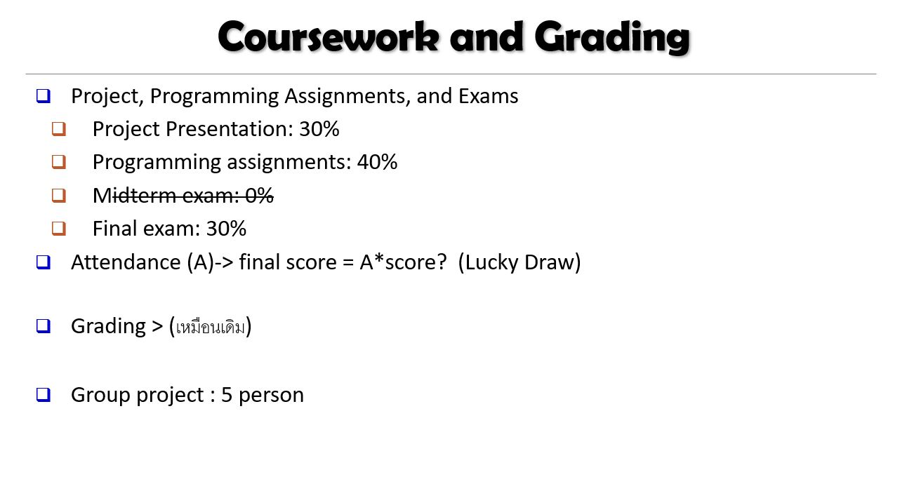

# DWDM21
Data Warehouse &amp; Data Mining 2021 

Thanapong Inthrah 62xxxxxxx

Group Name:

1 **_Me_**

2 AA

3 BB

4 CC

5 DD

# สารบัญเนื้อหา

วิชานี้เรียน ...

* บทที่ 1 [introduction](https://github.com/tohnperfect/DWDM21/blob/main/chapter1.md)
  * นิยาม data mining
  * ประเภท
* บทที่ 2 know your data ประกอบไปด้วย 3 ส่วยย่อยคือ
  * [basic python](https://github.com/tohnperfect/DWDM21/blob/main/Data101_(Chapter2).ipynb)
    * Casting
    * Data structure 
    * Loop
    * Condition
    * Function
  * pandas ...
